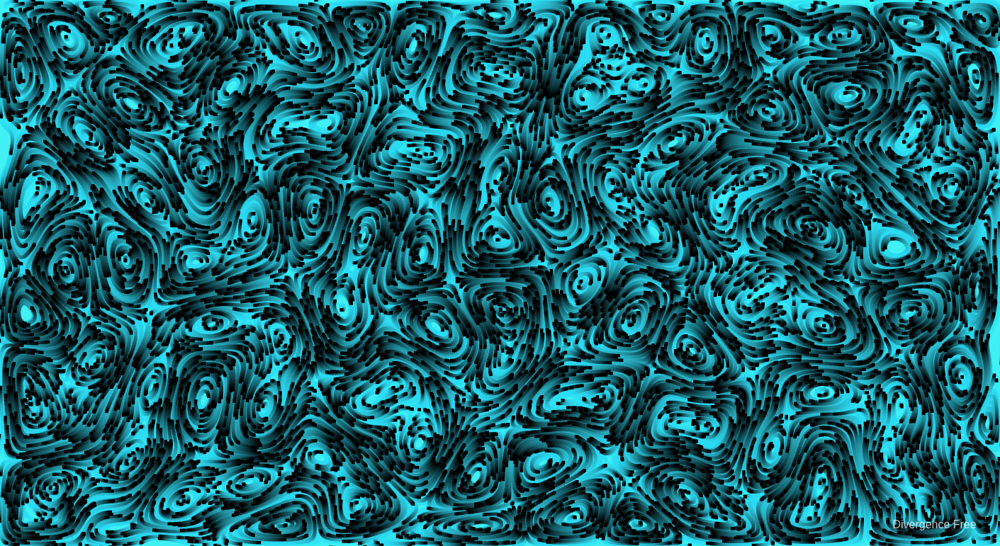

# Divergence Free

[Live Demo](http://art.muth.org)

## Features:

* GPL 3 Licensed (except for [webgl-noise](https://github.com/ashima/webgl-noise))
* Implemented in [Dart](https://www.dartlang.org)
* Using the [ChronosGL Engine](https://github.com/ChronosTeam/ChronosGL)
* Code at [https://github.com/robertmuth/DivergenceFree]

## Reading

[Curl-Noise for Procedural Fluid Flow - R. Bridson, J Hourihan, M. Nordenstam]
https://www.cs.ubc.ca/~rbridson/docs/bridson-siggraph2007-curlnoise.pdf